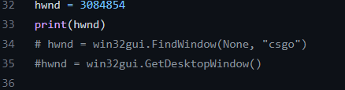
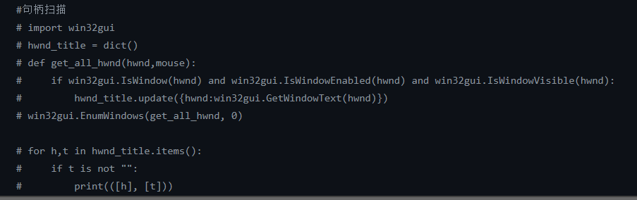
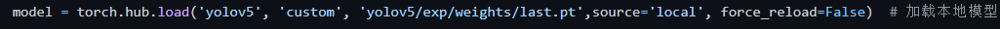

# YOLOv5_csgo

## Describe

A model and code for csgo character head detection and locking based on yolov5. The code is very rudimentary, and there are still many imperfections. So welcome everyone to communicate with me and improve this code.

## Declaration

### <font color='red'><u>**This is a practice and replication project for deep learning beginners. The project code can only be used for related knowledge learning and communication, and is not allowed to be used for the actual use of the game or to destroy the game environment.**</u></font>

### <font color='red'><u>**The code tests are all done on csgo's personal server and have not been run in any competitive competitions.**</u></font>

## Quick Start Examples

### install

```python
git clone https://github.com/ArmandRay/yolov5_csgo
pip install -r requirements.txt
```

### run

Run the main.py file in the main directory.

NOTICE: The game needs to run in windowed mode

### train and detect

If you need to train your own model or detect, the related method is the same as [yolov5](https://github.com/ultralytics/yolov5).

## Custom Parameters and Code Explanation

### window



Used to determine related windows and subsequent operations.

 You need to modify this parameter, or comment the statement and use the `FindWindow()` function below. The 'csgo' parameter in parentheses is the title of the window you want to look for.



If your `FindWindow()` function cannot find the relevant window, you can run the commented code at the bottom of the file separately. You can find the window handle you want in the output of the code.

NOTICE: If you use a fixed handle parameter, please do not close your window arbitrarily.

### model



If you need to use your own model, please modify it here.

## Reference

https://github.com/ultralytics/yolov5

https://blog.csdn.net/light169/article/details/123378140

https://www.jianshu.com/p/f08af400f2fa